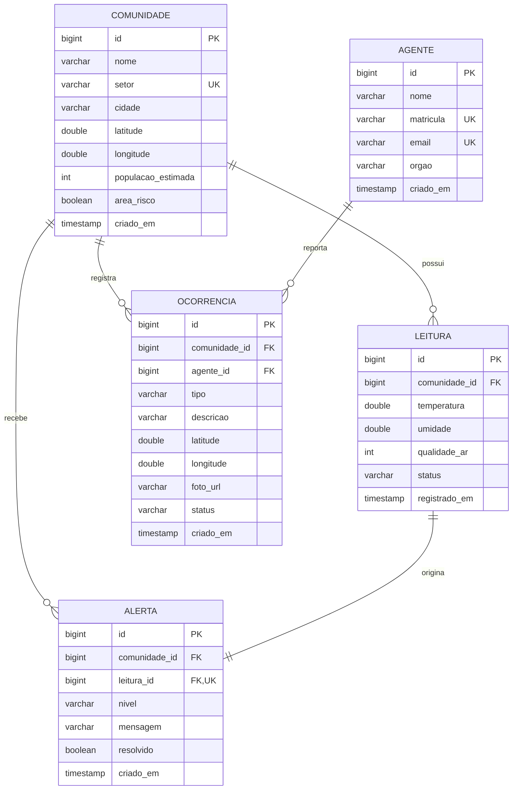

# Diagrama ER — LUPA

**FIAP Global Solution 2026/1 — Equipe GateMinds**
Parte 1 (Banco de Dados). Modelo relacional com 5 entidades e seus relacionamentos.

## Relacionamentos

| De | Para | Cardinalidade | Significado |
|----|------|---------------|-------------|
| Comunidade | Leitura | 1 : N | Uma comunidade tem muitas leituras de sensores ao longo do tempo |
| Comunidade | Ocorrência | 1 : N | Uma comunidade acumula muitas ocorrências registradas em campo |
| Comunidade | Alerta | 1 : N | Uma comunidade pode receber muitos alertas |
| Agente | Ocorrência | 1 : N | Um agente registra muitas ocorrências |
| Leitura | Alerta | 1 : 1 | Cada alerta nasce de exatamente uma leitura não-OK (FK única) |

## Regras de negócio refletidas no modelo

- **`leitura.status`** ∈ {`OK`, `RISCO`, `CRITICO`} — derivado da contagem de limiares ultrapassados
  (Temp > 32 °C, Umidade < 30 %, Qualidade do ar > 3800). 0 → OK, 1 → RISCO, 2+ → CRÍTICO.
- **`alerta`** é criado automaticamente quando uma leitura resulta em `RISCO` ou `CRITICO`
  (`ck_alerta_nivel` impede nível `OK`). A FK única `uk_alerta_leitura` garante o vínculo 1:1.
- **`ocorrencia.status`** ∈ {`ABERTA`, `EM_ANALISE`, `RESOLVIDA`} — ciclo de vida do chamado.
- Unicidades: `comunidade.setor`, `agente.matricula`, `agente.email`.
